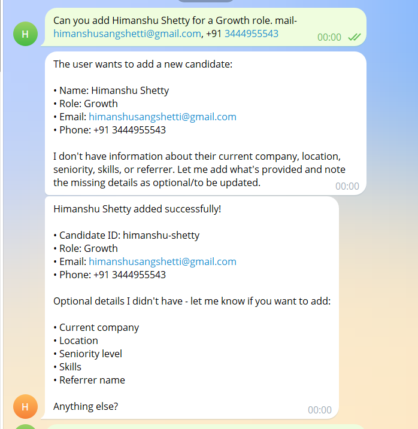
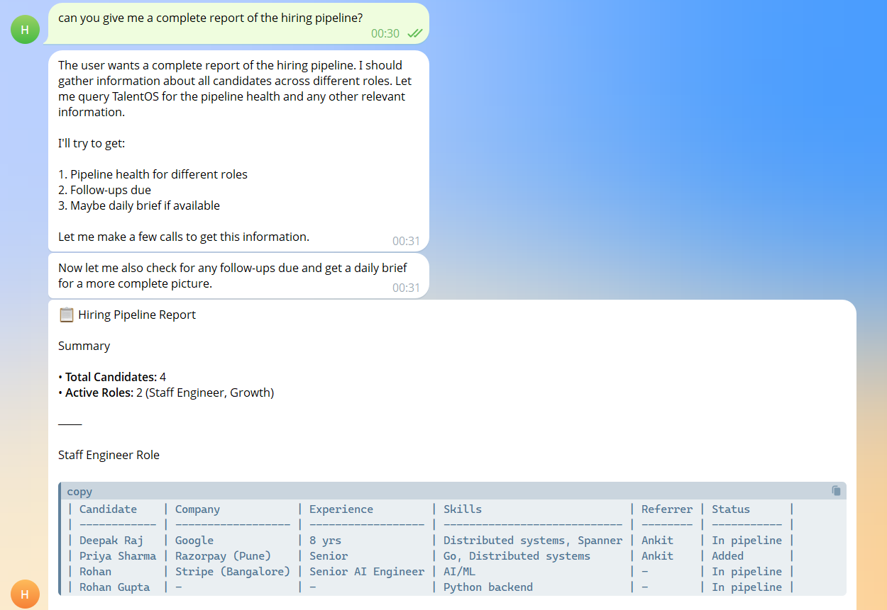
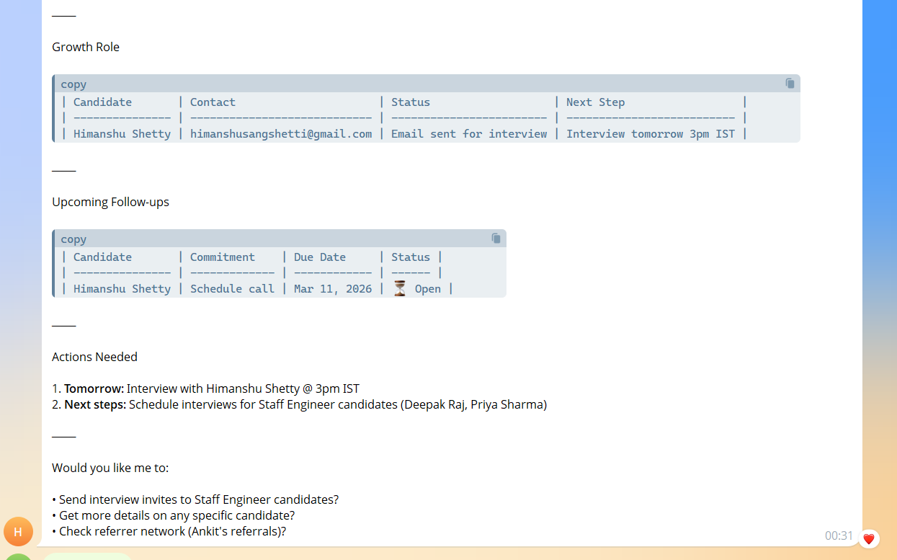
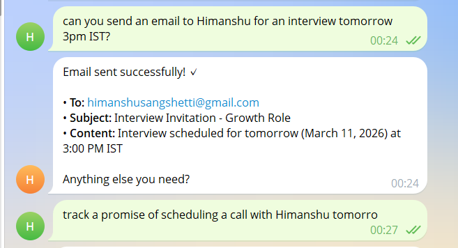
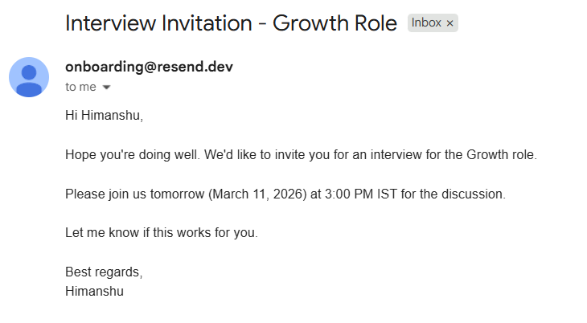
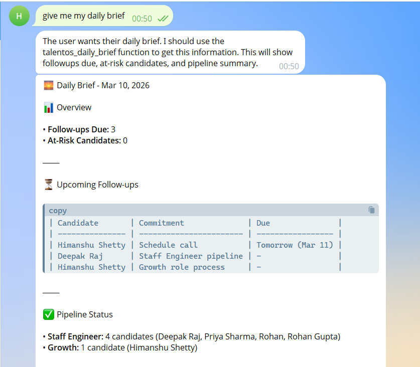
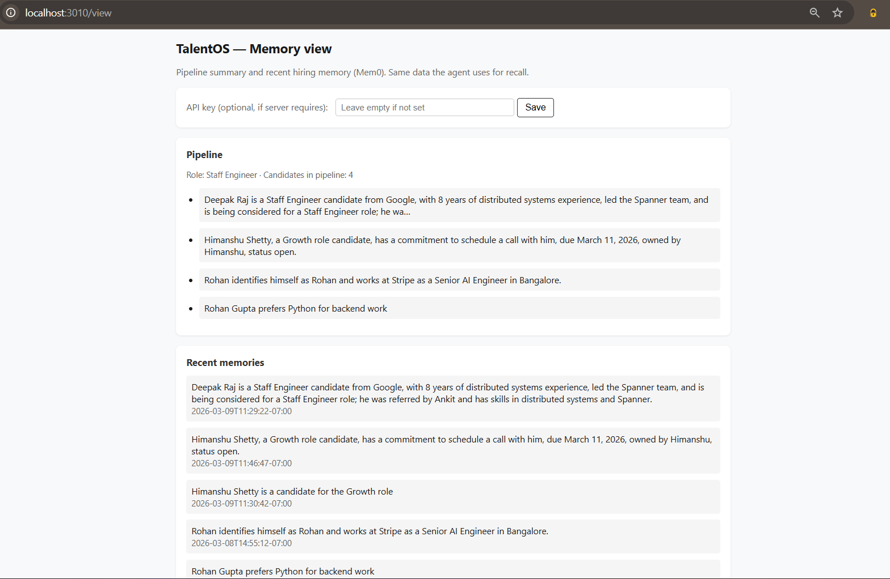

# TalentOS

**One place for your hiring pipeline.** Talk to the copilot in Telegram, WhatsApp, or the web—add candidates, log interviews, track follow-ups, get a daily brief, and send emails. Same memory everywhere.

Built as an **OpenClaw plugin** with **Mem0**: structured hiring memory (candidates, interactions, promises), auto-recall and auto-capture, and 10 tools so the agent can query and update pipeline without a separate ATS.

---

## What you can do

- **Add candidates** — Name, role, contact, referrer. Stored in Mem0, not lost in chat.
- **Log interactions** — Screening notes, stage updates, strengths/concerns. Timeline per candidate.
- **Track follow-ups** — “Schedule call with X tomorrow 3pm.” Surfaces in the daily brief and follow-ups list.
- **Query pipeline** — “Who’s in the pipeline for Staff Engineer?” “Who did Ankit refer?” “Pipeline health?” “Any candidates who expressed concerns about compensation?”
- **Daily brief** — Proactive summary: follow-ups due, at-risk candidates, pipeline snapshot. On demand or on a schedule (cron).
- **Send email** — “Send [candidate] an email to schedule a call.” Uses Resend; one message, no copy-paste.
- **Same memory, all channels** — Add in Telegram, ask in WhatsApp or from a webhook. One `user_id`, one pipeline.

---

## Quick start

1. **Repo:** `npm install`. Copy `.env.example` → `.env`, set `MEM0_API_KEY` (for the optional dashboard).
2. **OpenClaw:** Install the plugin into `~/.openclaw/extensions/talentos-hiring`, set `mem0ApiKey` and `userId` in config, allow the TalentOS tools, restart the gateway. → **[Setup](docs/SETUP.md)**
3. **Optional dashboard:** `npm run dev` → http://localhost:3010/view (read-only pipeline view).

---

## Repo layout

| Part | What it does |
|------|----------------|
| **openclaw-plugin/** | Skill, auto-recall/capture hooks, 10 tools + optional email. All hiring runs here; no separate API. |
| **View server** | Optional. `GET /view`, `GET /api/v1/talent/view` — dashboard and read-only API from Mem0. |

## Scripts

| Command | Purpose |
|--------|--------|
| `npm run dev` | Run view server (tsx). |
| `npm run build` | Compile TypeScript. |
| `npm start` | Run view server (node). |
| `npm run test` | Unit tests. |
| `npm run smoke` | Smoke test (server must be running). |

---

## Screenshots

Screenshots are in `docs/screenshots/`. Some flows use two images to show the full conversation or view.

**Add candidate** — Add a candidate in chat → agent confirmation.

**Full pipeline** — "Who's in the pipeline for [role]?" → table of candidates.

**Email to schedule call** — Send email → agent sends via Resend, confirmation.

**Follow-ups or daily brief** — "What follow-ups are due?" or "Give me the daily brief."

**Memory dashboard** — http://localhost:3010/view

---

## Docs

- **[ARCHITECTURE](docs/ARCHITECTURE.md)** — Diagram, tools, hooks, skill, view server, cron, webhook, memory schema.
- **[SETUP](docs/SETUP.md)** — Install, config, tools allowlist, view server, LLM (Ollama/Anthropic/OpenAI), cron, webhook, email.

License: ISC. See [LICENSE](LICENSE), [CONTRIBUTING](CONTRIBUTING.md), [SECURITY](SECURITY.md).
