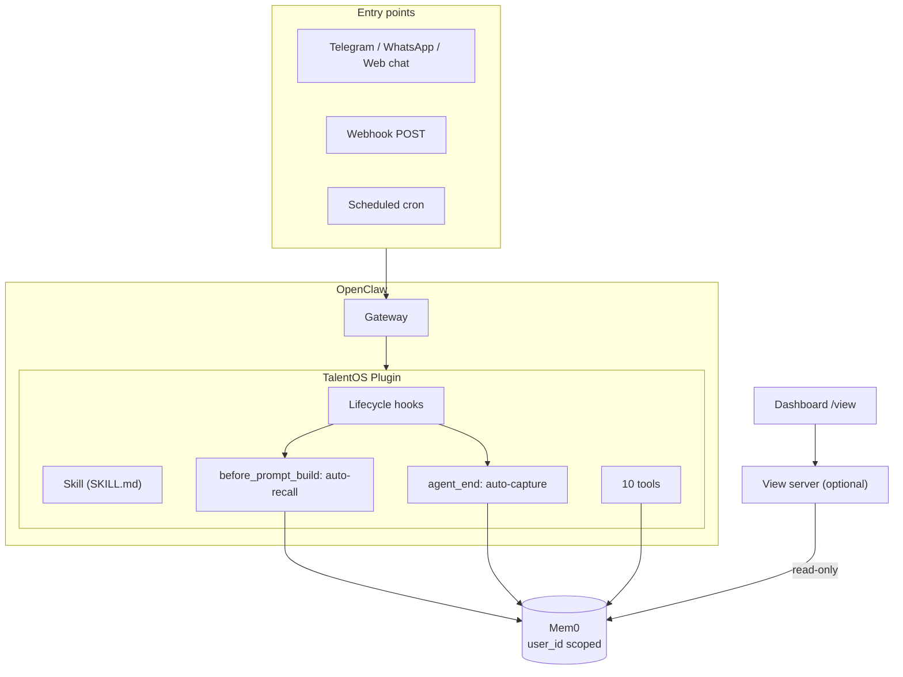
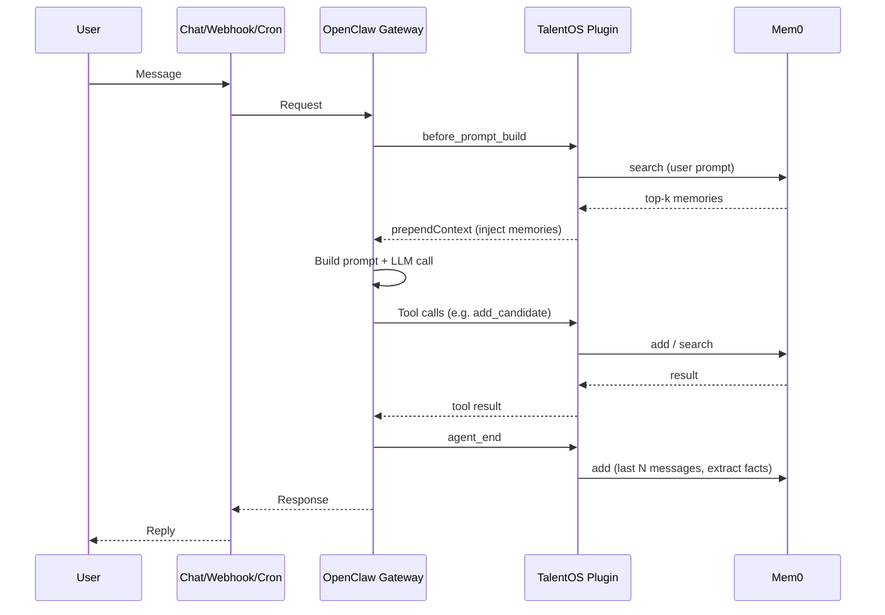
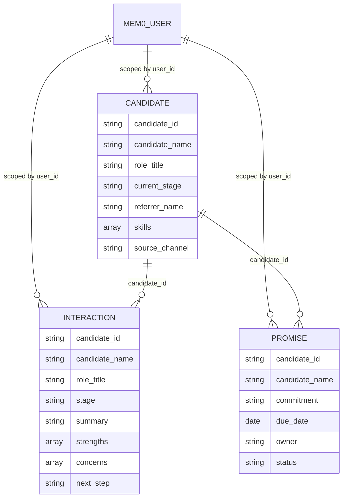

# Architecture

## System overview

TalentOS runs as an **OpenClaw plugin** that uses **Mem0** as the single source of truth for hiring memory. All write and read paths for hiring go through the plugin; an optional **view server** provides a read-only dashboard and API from the same Mem0 data.

### High-level architecture



- **One agent, one memory:** A single Mem0 `user_id` (plugin config) is used for chat, webhook, and cron. Add a candidate in Telegram, query in WhatsApp or from the webhook — same pipeline.
- **Plugin as the hiring brain:** The plugin owns all hiring behavior: skill instructions, auto-recall (inject relevant memories before each turn), auto-capture (store facts after each turn), and 10 tools that read/write Mem0. There is no separate TalentOS backend API.
- **View server is optional:** Express app that serves the dashboard and `/api/v1/talent/view` by querying Mem0 read-only. No hiring POSTs; useful for visibility and debugging.

### Request flow (user message to response)



### Component summary

| Component | Role |
|-----------|------|
| **Entry points** | Telegram, WhatsApp, web chat; webhook (e.g. ATS/form); OpenClaw cron (e.g. daily brief). |
| **OpenClaw gateway** | Routes messages to the hiring agent, runs LLM, invokes plugin hooks and tools. |
| **TalentOS plugin** | Registers hooks (auto-recall, auto-capture), 10 tools (add candidate, log interaction, timeline, daily brief, etc.), and the hiring skill. All tools call Mem0 directly. |
| **Mem0** | Stores and retrieves hiring memory (candidates, interactions, promises) with metadata; v2 search with filters and rerank. |
| **View server** | Optional Express app: `GET /view` (dashboard), `GET /api/v1/talent/view` (JSON). Reads from Mem0 only; optional Bearer auth. |

---

## Scope

**In scope:** Pipeline (candidates, stages), interactions, follow-ups, shortlist, timeline, referrer network, pipeline health, concern patterns, daily brief. Optional email via an installed OpenClaw skill (e.g. smtp-send).

**Not in scope:** Job requisitions, scheduling, scorecards, offer management, full ATS.

---

## Plugin: hooks and tools

### Lifecycle hooks (when `mem0ApiKey` is set)

| Hook | Purpose |
|------|--------|
| `before_prompt_build` | **Auto-recall:** search Mem0 with user prompt, inject top memories into context. |
| `agent_end` | **Auto-capture:** send last N messages to Mem0 for fact extraction. |

### Tools (all optional; all call Mem0 from the plugin)

| Tool | Purpose |
|------|--------|
| `talentos_add_candidate` | Store candidate profile (name, role, company, skills, referrer, etc.). |
| `talentos_log_interaction` | Log interview/event (stage, summary, strengths, concerns, next step). |
| `talentos_track_promise` | Track follow-up (commitment, due date, owner, open/closed). |
| `talentos_candidate_timeline` | Get timeline for one candidate (profile + interactions + promises). |
| `talentos_shortlist_candidates` | Shortlist by role (optional: skills, stage). |
| `talentos_followups_due` | Due follow-ups in a date range. |
| `talentos_referrer_network` | Candidates referred by a given person (optional: role). |
| `talentos_pipeline_health` | Pipeline summary for a role. |
| `talentos_concern_patterns` | Candidates who expressed concerns about a topic (optional: role). |
| `talentos_daily_brief` | Proactive brief: follow-ups due + at-risk + pipeline (optional: role, lookahead/stale days). |
| `talentos_send_email` | Send email via Resend (optional: requires `resendApiKey` and `resendFrom` config). |

Stages (normalized): `sourced`, `screening`, `assignment`, `technical`, `onsite`, `decision`, `offer`, `hired`, `rejected`.

### Skill

Plugin ships `skills/talentos-hiring/SKILL.md`. OpenClaw loads it when the plugin is enabled. It defines when to call which tool, proactive opener, compounding rules, and optional email: use `talentos_send_email` (Resend) when the user asks to send or draft email, if configured.

---

## View server

Express app: `GET /`, `GET /health`, `GET /view` (dashboard HTML), `GET /api/v1/talent/view?roleTitle=...&topK=...`. Reads from Mem0 only; no hiring POSTs. Optional Bearer auth via `TALENTOS_API_KEY`. Graceful shutdown (SIGTERM/SIGINT).

---

## Cron (daily brief)

OpenClaw cron runs the agent on a schedule and posts the reply to a channel. Recommended: one daily job that asks the agent to call `talentos_daily_brief` and post the summary.

```bash
openclaw cron add --name "Hiring daily digest" --cron "0 9 * * *" --tz "America/Los_Angeles" \
  --session isolated \
  --message "Generate the daily hiring brief for Staff Engineer. Call talentos_daily_brief (lookaheadDays=7, staleDays=7) and post the summary." \
  --announce --channel telegram
```

Manage: `openclaw cron list`, `openclaw cron run <job-id>`.

---

## Webhook

Trigger the agent from an ATS or form. In `openclaw.json`: `hooks.enabled: true`, `hooks.token`, `hooks.allowedAgentIds: ["hiring"]`. POST to `/hooks/agent` with `message`, `agentId: "hiring"`, optional `deliver` and `channel`. Same Mem0 memory as chat.

---

## Multi-channel

One `userId` in plugin config ⇒ same memory across all channels using that agent. Add in Telegram, query in Web UI — same data.

---

## Memory schema (Mem0)

Plugin stores hiring context with metadata. One `user_id` per config. All entities are stored as natural-language memories plus metadata so Mem0 can index and search them; tools use v2 search with filters.

### Entity model



**Entity types:** `candidate` | `interaction` | `promise`.  
**Stages:** `sourced`, `screening`, `assignment`, `technical`, `onsite`, `decision`, `offer`, `hired`, `rejected`.

**Candidate:** candidate_id, candidate_name, role_title, current_stage, referrer_name, skills, source_channel.  
**Interaction:** candidate_id, candidate_name, role_title, stage, summary, strengths, concerns, next_step.  
**Promise:** candidate_id, candidate_name, commitment, due_date, owner, status (open|closed).

Queries use Mem0 v2 search with filters (user_id, entity_type, role_title, etc.) and optional rerank.
